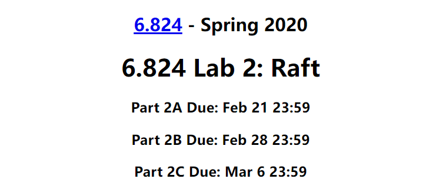

# Raft实验

> 实现了 [MIT 6.824 2020](http://nil.csail.mit.edu/6.824/2020/labs/lab-raft.html) 分布式系统课程中的实验2部分，即Raft算法部分。
> 

# Lab 2A Leader Election

实验2A要求实现论文中5.2节描述的内容，具体可以分为两个部分：

1. 集群初始化运行后，选出一个Leader，并通过发送心跳包来维护Leader身份。
2. 当网络出现故障时，可以正常选举出一个领导的Leader。

实验2A的也即通过测试这两个方面来判断实验是否正确。以下是我在做实验2A中总结的几个小经验，仅供参考。

- 实验前，再次过一遍论文，重点是第5章，对整个算法的流程和细节做到心中有数，盲目上手写代码只会事倍功半。**这点是做实验的前提！**
- 实验前仔细阅读[文档](http://nil.csail.mit.edu/6.824/2020/labs/lab-raft.html)中的内容，实验中遇到卡壳的部分，在回过来多看几遍文档中给的提示。
- 抓重点。实验2A是实验2的第一个实验，只需要实现上面描述的两个功能，因此对于实验2A的实验，你暂时可以仅考虑与实验2A有关的细节，例如论文5.4.1节的选举限制在实验2A中不需要考虑。与实验2A有关的细节基本就是5.2节描述的内容了，具体结合figure 2部分的细节描述。
  
    借鉴控制变量法的思维来进行实验，暂时不要把与实验2A无关的因素纳入考虑范围，这样有助于理清思路，快速编写代码。对于实验2A暂时不用考虑但是后续的扩展与实验2B、2C相关的部分，可以用注释和TODO的形式进行标记。

## 实验细节

实验2A中，主要的难点在随机选举超时（randomized election timeouts) 和定时发送心跳包这两个功能的实现，可以在实验前使用 [https://raft.github.io/](https://raft.github.io/) 网站提供的可视化功能模拟一遍选举超时和定时发送心跳包的过程，加深理解。

### 随机选举超时

如上图所示，集群初始化时，每个服务器节点都是Follower状态，每个节点都在等待超时。在实现细节上，可以通过记录一个 **超时时刻** `ElectionTime` 和一个 **随机超时周期** `ElectionTimeoutPeriod` 来判断节点是否超时，若超时，则转变身份为 Candidate，尝试发起投票选举自己为Leader。

`ElectionTime` 记录上一次收到 Leader 发送来的心跳包的时间。对于集群初始化时，每台服务器节点都是 Follower 状态，`ElectionTime` 记录节点的启动时间。

`ElectionTimeoutPeriod` 记录一个节点的随机超时周期，即在 `ElectionTime + ElectionTimeoutPeriod` 时间后还未收到心跳包，则表明节点超时。关于 `ElectionTimeoutPeriod` 大小的设置，参考文档中的提示部分。

下面用几张图描述一下 随机选举超时 的过程。图中表示集群中有 S1、S2、S3、S4 和 S5 五个节点，橙色外的绿色环表示当前节点距离下次超时还剩多少时间。

如此一来，就完成了集群初始时 Leader 的选举过程。当然，这只考虑了正常的情况下的选举流程，在实验2A的编码过程中，需要结合论文中的内容（figure 2 是重点）处理所有可能出现的异常情况。

### 定时发送心跳包

Candidate 成为 Leader 后，需要立即并发的向集群中的其他节点发送心跳包维护自己的 Leader 身份，并且需要周期性地发送心跳包，以保证正常情况下集群中 Leader 的唯一性。在具体实现上，可以通过维护一个 **心跳时刻** `HeartBeatTime` 变量和一个 **心跳超时周期** `HeartBeatTimeoutPeriod` 变量来保证 Leader 能够周期性地发送心跳包。

`HeartBeatTime` 变量记录 Leader 上一次发送心跳包地时间，`HeartBeatTimeoutPeriod` 记录心跳包发送的时间周期，每隔 `HeartBeatTimeoutPeriod` 时间向集群中的其他节点发送一次心跳包。

下面用两张图描述一下周期性发送心跳包的过程。

## 小结

- 理解 “随机超时选举和定时发送心跳包是如何相互作用配合，以保证集群中任意时刻只能有唯一一个 Leader 被选举出来” 实验2A的能够顺利通过的基础，这是 Raft 中关于 Leader 选举设计思想的核心。
- 在实验中，严格遵守 figure 2 中的准则；当遇到问题卡壳时，反复去看 figure 2 中的准则，看看是否出现了理解偏差。
---

# Lab 2B Log replication

实验2B通过调用 Start() 向 Leader 中添加一条日志，并使集群中各个节点的日志保持一致，

> the service using Raft (e.g. a k/v server) wants to start agreement on the next command to be appended to Raft's log. if this server isn't the leader, returns false. otherwise start the agreement and return immediately. there is no guarantee that this command will ever be committed to the Raft log, since the leader may fail or lose an election. even if the Raft instance has been killed, this function should return gracefully.
the first return value is the index that the command will appear at if it's ever committed. the second return value is the current term. the third return value is true if this server believes it is the leader.
> 

具体地，我们需要在 Start() 函数中实现以下流程：

1. 接收客户端发送地命令，并生成对应的 Log Entry，然后添加到 Leader 中的本地日志中。
2. Leader 并发的向服务器中的其它节点发送 AppendEntries RPC，要求其它节点将该Log Entry添加到它们的本地日志中。
3. Leader 收到了大多数节点的回复后（其它节点将Log Entry添加到本地日志中，并且回复的是我已成功添加），检查 Log Entry 的任期是否等于 Leader 的当前任期。[问题1](https://www.notion.so/Raft-ff577f44cce94c438c60ead5493c002a?pvs=21)
    - 若任期相等，则 Leader 将该 Log Entry 标记为 committed，即将 Leader 中的 commitIndex 增加到该 Log Entry 所在的 index，然后发送 ApplyMsg 到 ApplyCh，相当于应用该 Log Entry 中保存的命令到状态机中。
      
        当 Leader 将该 Log Entry 提交后（committed），发送一次心跳通知其它节点更新 commitIndex。
        
    - 若任期不相等，说明 Leader 发生了变更。（需要进行什么处理？）

**注意：上述流程的顺序很重要。**

## 实验中遇到的问题

### 问题1：Leader收到大多数Log Entry复制的响应后，需要检查Log Entry的任期与Leader的当前任期是否一致

我在做实验的过程中，忽略了这一步的检查。

### 问题2：对于figure 2中nextIndex和matchIndex的理解

`nextIndex` 是一个数组类型变量，数组大小对应集群中节点的数量。`nextIndex` 维护 Leader 在某一时刻已知的一组信息，具体地，对于 `nextIndex[i]`，表示 Leader 认为下一次发送 AppendEntires RPC 给节点 i 时，需要携带的 Log Entry 是从 Leader 的日志中 `nextIndex[i]` 位置往后的 Log Entry。

`matchIndex` 也是一个数组类型变量，数组大小对应集群中节点的数量。`matchIndex` 维护 Leader 在某一时刻已知的一组信息，具体地， `matchIndex[i]` 表示 Leader 认为节点 i 的日志中最大的 Log Entry 的下标。

正如 [Raft的学生指南](https://thesquareplanet.com/blog/students-guide-to-raft/#term-confusion) 中所述，`nextIndex` 和 `matchIndex` 容易混淆，特别是在实验中（自己在实验中也有很深的体会）。只有弄清楚 `nextIndex` 和 `matchIndex` 的更新时机、两者之间的关系，还有和 AppendEntries RPC 中参数 `prevLogIndex` 之间的关系，在编码阶段才会比较顺畅，debug时思路才会清晰。其次，`nextIndex` 的设计保证了 Leader 和 Follower 在日志冲突后，Follower 可以恢复成 Leader 一样的日志，从而保证了一致性。

上面的文字解释可能还会有些饶，下面尝试用图结合例子的形式来理解 nextIndex 和 matchIndex，以及两者的更新时机。

**示例一：**

先考虑一种简单的情况。某一时刻 Leader 和 Follower 中的日志内容完全一致，Leader 收到了两条命令，并添加其到本地日志中，然后向服务器中的其它节点发送 AppendEntries RPC。Leader 根据 `nextIndex` 中的值来决定将自己日志中的哪些 Log Entry 组装为 AppendEntries RPC 参数中的 `entries` 字段，发送给对应的节点。更具体地，Leader 将自己日志中 `nextIndex[i]` 位置及之后的日志组装为 `entries` 字段，包装在 AppendEntries RPC 的参数中。如下图所示。

在上面这幅图的例子中，Follower 和 Leader 的日志保持一致，Leader 就可以直接根据 nextIndex 的值选择将索引下标为5及之后的 Log Entry 复制给 Follower，即上图中将命令为 E 和 F 的两条 Log Entry 复制给 Follower(1) 和 Follower(2)。（日志不一致的情况在下一个示例中给出）

**nextIndex 什么时候更新？**Follower 收到 Log Entry 复制请求后，将 Log Entry 复制到本地日志中，然后回复一个响应给 Leader，Leader 根据响应中的参数（论文中 figure 2）来进行下一步处理，若 `success` 为 true，说明Log Entry已被复制到了Follower的本地日志中，因此 Leader 更新 `nextIndex` 中的值。总结来说，Leader 收到 Follower(i) 的成功响应后（`success` 为 true），更新 `nextIndex[i]`。

再考虑这样一种情况，如下左图所示。节点1为T1时期的Leader，Index 3 及之前的 Log Entry 已经提交（committed），然后宕机了。在节点1 宕机的时间内，节点0被选为Leader，将 nextIndex 初始化为Leader日志中最后一个Log Entry 的 Index + 1，即 `nextIndex = [4, 4, 4]`，然后添加并复制了Index4和Index5两条Log Entry，得到了节点2的成功响应，此时的 `nextIndex = [6, 4, 6]`。紧接着，节点1恢复运转，Leader又收到了两条命令，并且将其复制到本地日志中，然后发起 AppendEntires RPC，此时Leader根据 `nextIndex[i]` 来确定将 Leader 中的哪些 Log Entry 发送给 节点 i，如下右图所示。

**示例二：在 Leader 和 Follower 日志不一致的情况下，借助 nextIndex 使 Follower 和 Leader 的日志保持一致，同时理解 matchIndex 与 nextIndex 之间的关系**

如下图所示，集群中各节点的日志按如下时间线变化。

1. t0时刻，集群中各节点的日志保持一致。
   
    
    
2. t1时刻，Leader收到两条命令，将其添加到本地日志中（[term2, index6] 和 [term2, index7]），并向其它节点发送 AppendEntries RPC。
   
    
    
3. t2时刻，Leader 在收到大多数节点的响应前，又接收到两条命令，并将其添加到本地日志中（[term2, index8] 和 [term2, index9]）。
   
    
    
4. t3时刻，Leader 收到了节点2和节点4的成功响应，更新 nextIndex[i] 的值（如下图所示），然后 Leader 将[term2, index6] 和 [term2, index7] 两条 Log Entry 设置为 committed。
   
    
    
5. t4时刻，Leader（节点0）宕机了，而节点1和节点3因网络故障导致没有收到 [term2, index6] 和 [term2, index7] 两条 Log Entry。
   
    
    
6. t5时刻，节点4成为Leader，提升任期为T3。Leader 发生变更，对nextIndex和matchIndex进行初始化，如下图所示。
   
    
    
7. t6时刻，节点0恢复运行。与此同时，Leader收到两条命令，并将其保存到本地日志中（[term3, index8] 和 [term3, index9]），然后向其它节点发送 AppendEntries RPC。
   
    
    
8. t7时刻，Follower 节点进行日志一致性检验，并将日志复制到本地中，以保证Leader和Follower节点日志的一致性。下来看看是如何利用 nextIndex 同步Leader和Follower之间的节点。
   
    节点2在复制前和 Leader 的日志匹配，一致性检验通过，直接将[term3, index8] 和 [term3, index9]两条 Log Entry复制到节点2的本地日志中即可。
    
    节点1和节点3与Leader日志不匹配（在编码中，Follower节点比较自身的 Log Entry 信息和 AppendEntries RPC 参数中的 prevLogIndex 、 prevLogTerm 进行检测），因此 Leader 需要找到和 Follower 不冲突且索引位置（假设这个索引位置用 `idx` 表示）最大的 Log Entry，然后Follower丢弃这些冲突的Log Entry，根据Raft的强领导人的设计原则，将Leader日志中idx之后位置的所有 Log Entry 复制给Follower。在编码实现上，日志一致性检测失败，则减少 nextIndex[i] 的值，然后重复发起 AppendEntries RPC，直到通过一致性检测，然后将Log Entry复制到本地日志中。对于节点1和节点3，即不断减少 `nextIndex[1]` 和 `nextIndex[3]` 的值，直到nextIndex[1]和nextIndex[3]等于6。如下图所示。
    
    
    
    节点0的处理方法同上。
    
9. t8时刻，集群中节点全部保持日志一致性。
   
    
    

`AppendEntriesArgs`参数中的 prevLogIndex 等于 Leader 中为该 peer 保存的 nextIndex 的值减一，即 `prevLogIndex = nextIndex[peer] - 1` 。可以是 GetLastLog.Index 吗？这两者的区别是什么？

**错误1：在一个新的Log Entry添加到Leader的日志中后，nextIndex[peer]++**

nextIndex[i] 表示 Leader 发送给 peers[i] 节点的 Log Entry 在 peers[i] 本地日志中的索引位置，因此应该在 peers[i] 成功复制 Log Entry 到本地日志后，并且 Leader 收到了 绝大多数响应后，才进行 nextIndex[peer]++ 操作，但是这又会涉及并发操作带来的不一致性问题。

# Lab 2C Persistent

待补充...

